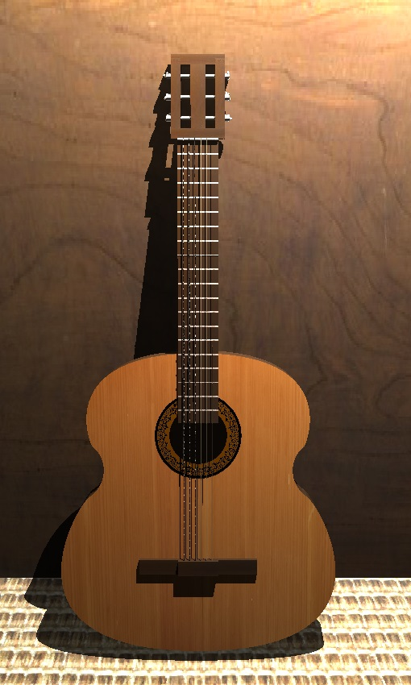
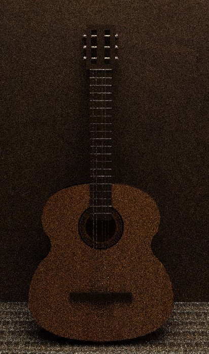

# Informe de Gráficos por Computadora:

## Integrantes:

- Luis Ernesto Ibarra Vázquez C-411
- Damián O'Hallorans Toledo C-411

## Foto guía

El objetivo del proyecto es realizar una foto lo más similiar a la foto presentada.

## Modelado:

Para el modelado de la guitarra se usaron en su mayoría cajas y cilindros. Se usaron transformaciones lineales para obtener la forma y posición deseados.

Para el modelado del cajón de la guitarra se usó una curva de Bezier para el contorno.

El resultado final del modelo es la siguiente malla.

## Texturas:

Las texturas en el proyecto se usaron principalmente para proporcionarle color al modelo. Otro uso de las texturas fue en propocionarle un relieve de enrollado a las tres cuerdas de la izquierda. Se pueden ver las texturas usadas en la carpeta *textures.rar*.

PONER FOTO DE LAS CUERDAS CON LAS TEXTURAS

## Raytracing:

Al realizar raytracing sobre el modelo anterior se obtuvo el siguiente resultado.

## Pathtracing:

Al realizar pathtracing sobre el modelo anterior se obtuvo, luego de 66 iteraciones demorando aproximadamente 13 horas, el siguiente resultado.

## Comparación:

Aquí se puede observar la comparación entre los resultados obtenidos con la foto objetivo.

PONER FOTO DE LAS TRES JUNTAS PARA COMPARACIÓN

## Instrucciones:

Para correr el proyecto debe:

1. Descomprimir el archivo **textures.rar** en la carpeta del ejecutable, asegurandose que se puedan acceder a estas mediante la dirección *textures/\<nombre de imagen\>* 
2. Correr el ejecutable.