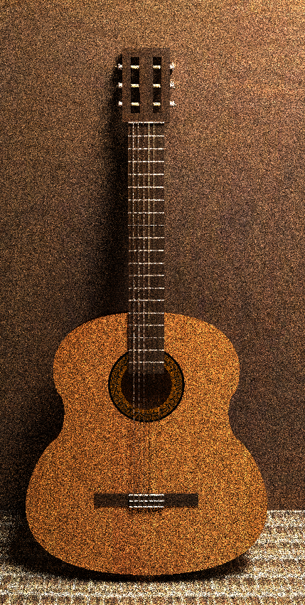

# Informe de Gráficos por Computadora:

## Integrantes:

- Luis Ernesto Ibarra Vázquez C-411
- Damián O'Hallorans Toledo C-411

## Solución de C#

La solución **Main.sln** se divide en dos proyectos. El primero es un WindowsForms realizado para un mayor dinamismo a la hora de construir el modelo ya que presenta algunas opciones para modificarlo sin tener que cambiarlo directo en el código. El segundo proyecto es el **Renderer** original pero se le ha estado apilando los cambios de las diferentes etapas del curso. 

Se recomienda usar el proyecto **Renderer** para correr el programa. Mirar en este el método **Main** del **Program.cs** para acomodar el resultado del programa a lo que se quiere, aquí se puede cambiar propiedades como:

- Altura y Ancho de la imagen.
- Proporción Ancho/Alto de la imagen.
- Técnica utilizada para mostrar el modelo.

## Foto guía

El objetivo del proyecto es realizar una foto lo más similiar a la foto presentada.

## Modelado:

Para el modelado final de la guitarra se usaron en su mayoría cajas y cilindros. Se usaron transformaciones lineales para obtener la forma y posición deseados.

Para el modelado del cajón de la guitarra se usó una curva de Bezier para el contorno.

El resultado final del modelo es la siguiente malla.

## Texturas:

Las texturas en el proyecto se usaron principalmente para proporcionarle color al modelo. Otro uso de las texturas fue en propocionarle un relieve de enrollado a las tres cuerdas de la izquierda. Se pueden ver las texturas usadas en la carpeta *textures*.

Cuerdas aplicando el bump map. Se observa un efecto de corrugado en ellas, aunque en realidad es un cilindro.

## CSG:

Se realizó un premodelado de la guitarra usando CSG, pero no se avanzó por este camino, debido a la dificultad de modelar el cajón de la guitarra por esta vía. A continución se observa el modelo al aplicarle un simple raycasting.

## Raytracing:

Al realizar raytracing sobre el modelo basado en mallas se obtuvo el siguiente resultado.

## Pathtracing:

Al realizar pathtracing se obtuvo el siguiente resultado. Este se detuvo en el paso 384 luego de aproximadamente 24 horas de cómputo.

## Comparación:

Aquí se puede observar la comparación entre los resultados obtenidos con la foto objetivo.

