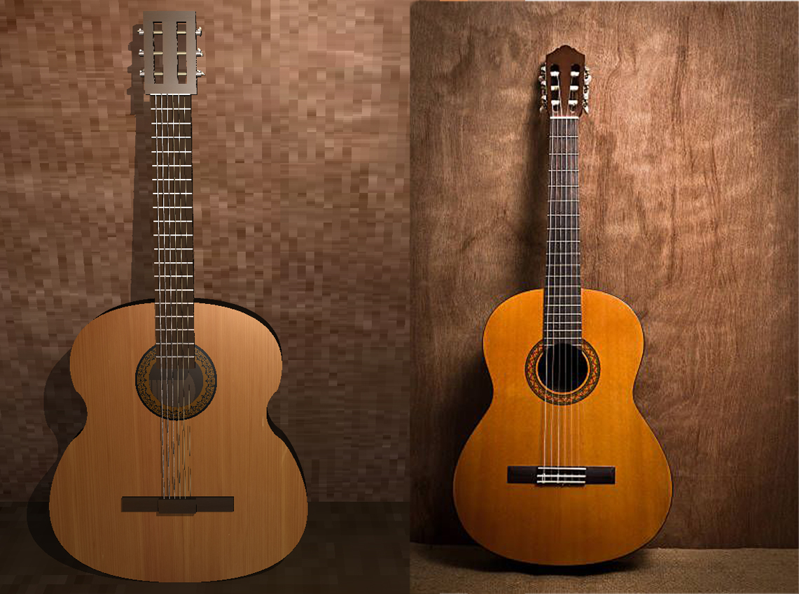

# Informe de Gráficos por Computadora:

## Integrantes:

- Luis Ernesto Ibarra Vázquez C-411
- Damián O'Hallorans Toledo C-411

## Foto guía

A la izquierda se presenta el resultado final, a la derecha la foto en cual está basado el modelo.

## Instrucciones:

Para correr el proyecto debe:

1. Descomprimir el archivo **textures.rar** en la carpeta del ejecutable, asegurandose que se puedan acceder a estas mediante la dirección *textures/\<nombre de imagen\>* 
2. Correr el ejecutable.

## Modelado:

Para el modelado de la guitarra se usaron en su mayoría cajas y cilindros, usando transformaciones lineales se cambiaron para que obtuvieran la forma deseada.

Para el modelado del cajón de la guitarra se usó una curva de Bezier para el contorno, además de la función raíz para modelar el hueco en este.

## BRDF:

En el proyecto se usaron las BRDF...

## Texturas:

Las texturas en el proyecto se usaron principalmente para cubrir los objetos para darle una apariencia más realista.

Algún otro uso...

## Luz:

En el proyecto están presentes dos fuentes de luz. Una  en la esquina superior derecha de la imagen, esta es la que brilla con más intesidad que la otra situada en la posición de la cámara. Esta última se colocó con la intesión de iluminar el área visible para evitar que la imagen se viera opaca. 