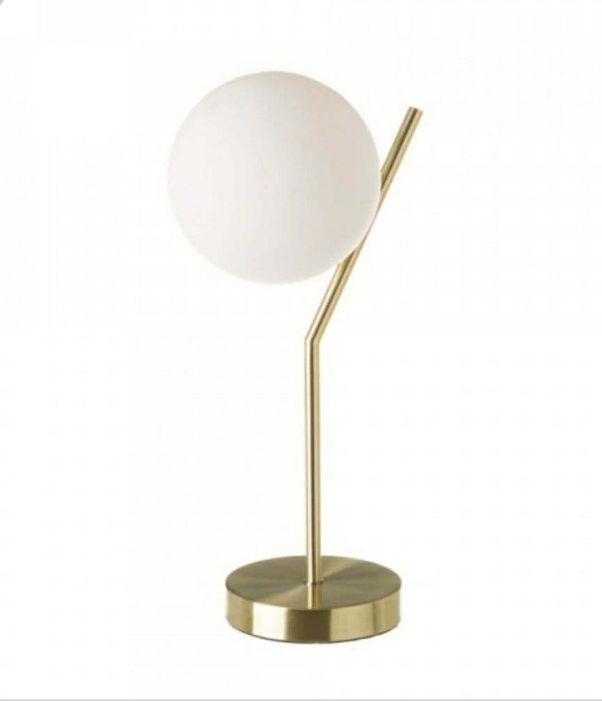
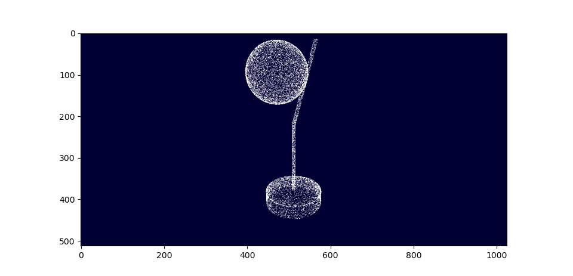
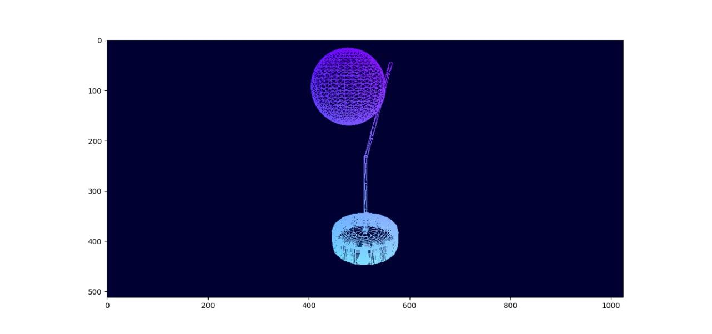
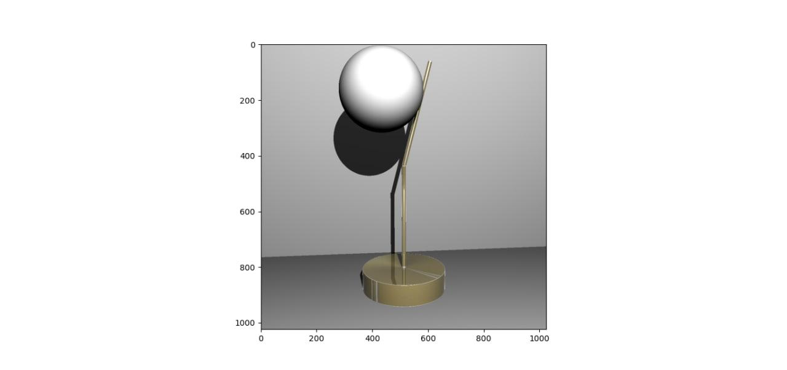
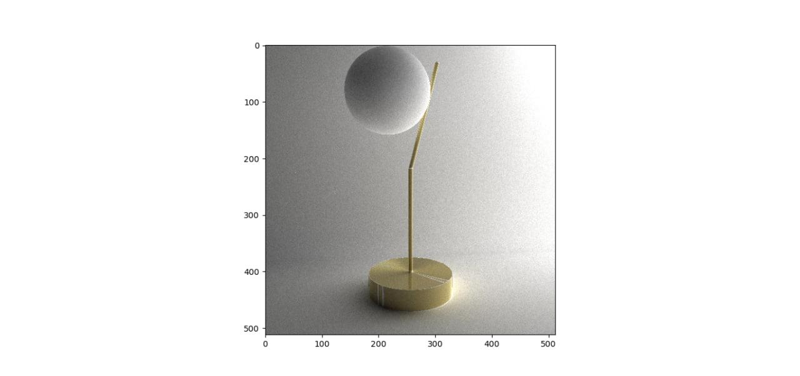

# Computación Gráfica

- Yan Carlos González Blanco               **C411**
- Henry Estévez Gómez                         **C411**
- José Carlos Hernández Piñera           **C411**

#### Imágen original:

Partiendo de la imagen seleccionada pasamos a aplicar los distintos métodos  estudiados que explicaremos más adelante hasta lograr obtener la mejor réplica posible.

#### 1. Nube de Puntos:

Este método conciste en obtener un aproximación de la figura a partir de la generación de puntos aleatorios que pertenezcan a la superficie de la misma.

El primer paso fue modelar la figura geométricamente para esto la dividimos en  difirentes regiones:

**base**: Esta está conformada por un cilindro que lleva como tapa superior una circunferncia.

**tubos**: Ambos tubos se obtienen mediante dos cilindros.

**foco**: Este se forma mediante una esfera.

Para generar todas la figuras geométricas necesarias utilizamos sus ecuaciones paramétricas variando sus parámetros para obtenerlas mediante un conjunto de puntos aleatorios en su superficie (nube de puntos), una vez generada las mismas aplicamos la transformada _scale_ para  obtener en estas las dimensiones correspondientes a la imagen, luego rotamos y trasladamos  mediante las transformadas _rotate_ y  _traslate_ para ubicar las mismas en sus respectivas posiciones y asi obtuvimos nuestra primera fase de la imagen mediante este método.

#### 2. Mallas:

De forma similar al método anteriar usando las ecuaciones paramétricas pero esta vez mediante la utilización del método _Manifold_ de la clase Rendering obtenemos nuestra figura conformada por mallas.

Luego se aplicaron las mismas tranformadas para obtener la escala deseada y ubicación, de esta forma obtuvimos nuestra segunda fase de la imagen:

 

#### 3. Texturas:

Para agregarles texturas a la figura utilizamos la técnica _mapping texture_ con la cual podemos aplicarle la textura de metal dorado a la base y los tubos de la lámpra y a estos le agregamos características de espejo para que este material refleje de cierto modo la luz que incide en él. El foco posee una textura de color blanco.

Una ves agregada las texturas pasamos a utilizar los distintos algoritmos de iluminación vistos en conferencia con los cuales obtuvimos aproximaciones de la figura.

#### 4. Raytracing:

Como el raytracing utiliza la iluminación directa, ubicamos la posición de la luz alejada de nuestra lámpara y con mayor intensidad para asi obtener mas iluminación en toda la imagen, también la luz se encuentra ubicada de forma lateral-delante (diagonal derecha delantera) para obtener la sombra de nuestra lámpara en el plano trasero y observar la diferencia de iluminación en el foco entre el lado donde la luz le incide directamente y el lado en que no y posee sombra, esto nos ayuda con la profundidad de la lámpara con respecto al plano trasero. 

#### 5. Pathtracing:

El paththracing aplica iluminación global por lo que utilizamos una esfera de emisión donde el valor emisivo es la intencidad de la luz sobre el área de la esfera para de esta forma distribuir la luz de manera uniforme. La ubicación de la esfera de luz fue lateral trasera de esta forma obtumivos mas detalles con respecto a la sombra del foco y en la base las zonas donde la luz no da directamente, al igual q logramos resaltar la propiedad de espejo que posee la base donde se observa detalles como el reflejo de parte del tubo. 

Esta imagen la obtuvimos luego de 4070 iteraciones:

